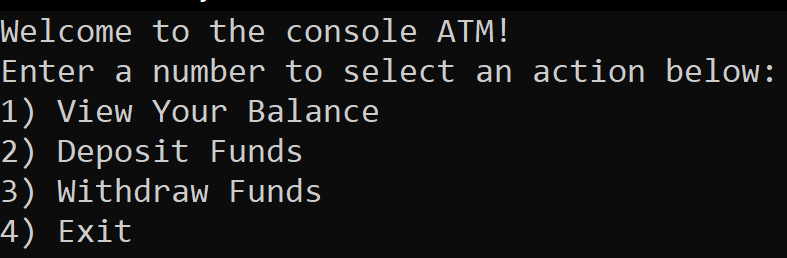
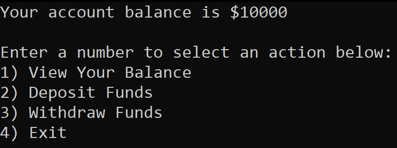
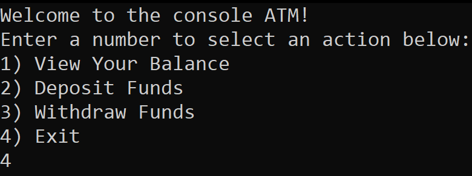

# Lab 02 Unit Tests and Documentation

*Author: Peyton Cysewski*

----

## Description

This console application is a simple ATM simulator. Each time the application is run the user starts out with $10000.00 in their ATM account. The user is then presented with four options: to view the current balance, deposit money into it, withdraw money from it, or exit the ATM. Deposits and withdrawals cannot be negative and the withdrawal amount cannot supercede the amount remaining in the account.

---

### Getting Started
Clone this repository to your local machine.

```
$ git clone https://github.com/Peyton-Cysewski/Lab02-Unit-Tests-and-Documentation.git
```

### To run the program from Visual Studio:
Select ```File``` -> ```Open``` -> ```Project/Solution```

Next navigate to the location you cloned the Repository.

Double click on the ```Lab02-Unit-Tests-and-Documentation``` directory.

Then select and open ```Lab02-Unit-Tests-and-Documentation.sln```

---

### Visuals

#### Application Start

#### Using the Application

#### Application End


---

### Change Log
1.1: *Initial Release of the console ATM app* - 7 July 2020  


------------------------------